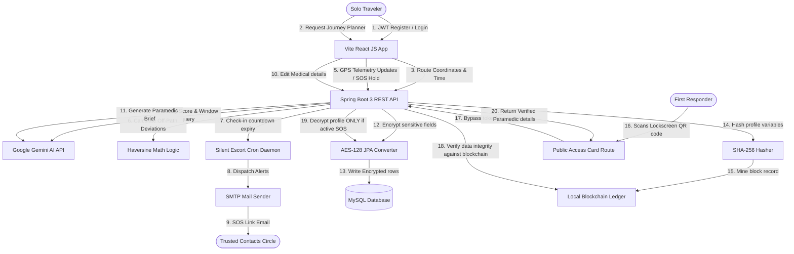

# SwaSuraksha — AI-Powered Journey Safety & Blockchain Medical Ledger

SwaSuraksha (*"Feel Free to Travel"*) is a proactive, full-stack personal safety and emergency response ecosystem. By combining live GPS telemetry, **Google Gemini AI** safety assessment models, background check-in timer daemons, **AES-128 column-level database encryption-at-rest**, and a **SHA-256 blockchain database integrity ledger**, SwaSuraksha safeguards solo travelers when they need it most.

---

Contributors :
Nandani singh
Ayushi Sinha Saba Parveen

## 📐 Platform Architecture Diagram

GitHub will automatically render the flow diagram below. It illustrates how user telemetry, AI services, database encryption, and blockchain verification modules coordinate:



---

## 📂 Project Directory Structure

```text
swasuraksha-backend/
├── src/main/java/com/swasuraksha/      # Spring Boot Java Backend
│   ├── config/                         # Security & CORS filters setup
│   ├── controller/                     # REST API Controllers (endpoints mappings)
│   ├── dto/                            # Data Transfer Objects (Req/Res formats)
│   ├── entity/                         # JPA Database Entities (MySQL models)
│   ├── exception/                      # Global API Exception Handlers
│   ├── repository/                     # Database Repository Queries
│   ├── security/                       # Custom JWT Authentication filters
│   ├── service/                        # Business Logic (AI, QR, Blockchain services)
│   └── util/                           # JPA Database Encryption utilities
├── src/test/java/com/swasuraksha/     # JUnit Integration Test suite
├── src/main/resources/                 # application.properties & SMTP credentials
├── frontend/                           # Vite React JS Frontend Client
│   ├── src/
│   │   ├── components/                 # Global UI layouts (Navbar, GlassCard)
│   │   ├── context/                    # AuthContext (Auth & Hindi/English translations)
│   │   ├── services/                   # Axios API settings (Interceptors)
│   │   └── views/                      # 9 visual dashboards (Dashboard, RouteAI, Admin)
│   └── vite.config.js                  # Frontend build configurations
└── README.md                           # Project Documentation
```

---

## 🛠️ Technology Stack

| Layer | Technology / Library | Role |
| :--- | :--- | :--- |
| **Backend Framework** | Spring Boot 3.3.2 | Core API Service engine & Dependency Injection |
| **Security Layer** | Spring Security & JWT | Stateless token authorization & CORS filters |
| **AI Integration** | Google Gemini API (gemini-1.5-flash) | Route safety analysis & Paramedic briefs |
| **Database** | MySQL | Persistent data storage |
| **Cryptography** | AES-128 / SHA-256 | Database encryption-at-rest & Blockchain hashing |
| **QR Engine** | ZXing (Zebra Crossing) | Encodes public access links into PNG images |
| **Frontend Framework**| ReactJS (Vite scaffolding) | Client interface |
| **Styling CSS** | Obsidian & Cyan Glassmorphism | Custom design tokens and responsive grid layout |

---

## 🌟 Key Features

1. **SOS Guard (Accidental Protection)**: Hold-to-trigger SOS button (3-second duration with browser haptics support) followed by a 5-second cancel countdown.
2. **Silent Escort Daemon**: Background Spring cron worker that automatically triggers alerts to your contacts if you miss your arrival threshold check-in.
3. **Gemini AI Safety Scoring**: Predicts safest hours, risk rating percentages, and reviews environmental factors of your routes.
4. **Dynamic QR Lock**: Keeps medical profile details fully locked and private unless an active SOS alert is running.
5. **Blockchain Audit verification**: Recalculates hashes on scanner request and compares against blockchain ledger to prevent database tampering.
6. **One-Tap Help Desk**: Instantly maps nearest safe spot coordinates and provides dial anchors to closest Police/Hospital helplines.
7. **Accessibility Switcher**: English/Hindi navbar toggle translation.

---

## 🚀 Local Setup Instructions

### 1. Database Setup (MySQL)
Open your database console and create a new schema matching the configurations:
```sql
CREATE DATABASE swasuraksha_db;
```

### 2. Configure Environment
Verify database credentials inside [application.properties](file:///src/main/resources/application.properties):
```properties
spring.datasource.url=jdbc:mysql://localhost:3306/swasuraksha_db
spring.datasource.username=root
spring.datasource.password=YOUR_PASSWORD
server.port=8086
```

### 3. Run Backend Server
Execute in project root:
```bash
mvn clean compile
mvn spring-boot:run
```
*The backend REST services will boot up on port `8086`.*

### 4. Run Frontend Client
Execute in the `frontend` folder:
```bash
cd frontend
npm install
npm run dev
```
*The React client will spin up locally on `http://localhost:5173/`.*
